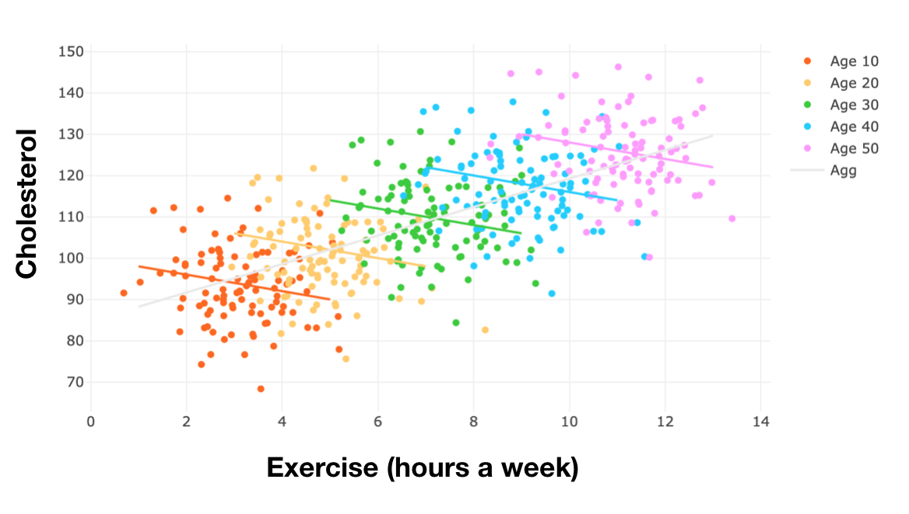

# 1. 들어가며: 상관관계 vs. 인과관계

첫 번째 글은 상관관계가 인과관계를 내포하지 않을 수 있다는 것을 예시를 통해 보이고자 합니다. 

다음과 같은 흥미로운 예시를 생각해 보겠습니다. 데이터 전문가 Yonghan 이 최근에 건강검진을 받았는데 **콜레스테롤**이 높게 나왔습니다. Yonghan 의 담당의사는 그에게 **운동**을 꾸준히 하여 콜레스테롤 수치를 줄여야 한다고 권고했습니다. 의심많은 과학적 회의주의자인 Yonghan은 운동-콜레스테롤의 관계가 어떻게 되는지 직접 판단하기 위해 수많은 사람들의 '매주 운동량 (hr)' - '콜레스테롤' 데이터를 수집하고, 선형회귀분석을 통해서 그 경향을 분석했습니다. 분석 결과는 [그림 1]과 같이 운동량-콜레스테롤의 양의 상관관계를 보여주었습니다.   

|          |
| :--: |
| *[그림 1] 운동량 - 콜레스테롤* |

이 결과를 바탕으로 데이터 전문가는 ‘운동을 많이 할수록 콜레스테롤이 증가한다’ 라고 결론을 내려야 할까요?

이 예시를 조금 더 진행해보겠습니다. 연령 (Age) 데이터 (10대, 20대, …, 50대) 를 추가로 수집했다고 가정하죠. **각 연령별로** 운동-콜레스테롤의 관계를 분석하기 위해서 선형회귀분석을 수행했더니 *[그림 2]* 와 같은 분석결과가 나왔습니다. 보시다시피, 모든 연령별 결과에서, Exercise-Cholesterol 은 음의 상관관계를 나타냈습니다.

|          |
| :--: |
| *[그림 2] **연령별** 운동량 - 콜레스테롤* |

그렇다면, 우리는 이를 어떻게 설명해야 할까요? 운동을 하면, 콜레스테롤은 증가할까요 (*[그림 1]*)? 아니면 감소할까요 (*[그림 2]*)? 물론, 우리는 상식선에서 운동이 콜레스테롤을 감소시킨다는 것을 알고 있습니다 ([근거](https://www.ahajournals.org/doi/full/10.1161/01.CIR.0000048890.59383.8D)). 따라서, [그림 2] 가 true causality 를 주며, 운동-콜레스테롤 사이의 상관관계 ([그림 1])은 인과관계를 왜곡시킨다는 것을 알 수 있습니다. 이에 대한 자세한 분석은 글이 연재됨에 따라 자세히 다루어질 예정입니다. 

이 이야기의 핵심은, 두 변수간의 인과관계 (운동 -> 콜레스테롤)을 파악하기 위해서는 상관관계만으로는 부족하다는 것입니다. 하지만 아주 많은 경우에, 상관관계가 인과관계가 아니라는 사실은 간과되곤 합니다. [그림 3] 은 상관관계가 어떻게 인과관계로 호도되고 있는지 예시를 보여줍니다. 

|          |
| :--: |
| *[그림 3] 상관관계 vs. 인과관계* |

모두 저명한 의학분야 논문 (New England Journal of Medicine) 에서 발최한 기사들입니다. 보시듯, 음주가 건강에 긍정적인 효과가 있는지 / 부정적인 효과가 있는지 같은 저널 안에서도 의견이 이렇게 나뉩니다. 위 논문들은 모두 경향성을 분석한 것임에도 불구하고, 저명한 의학 논문조차 상관관계와 인과관계를 호도하는 것을 볼 수 있습니다. 

상관관계는 오직 경향성만을 보여주는데, 이를 바탕으로 인과관계를 이끌어내기 위해서는 데이터 생성과정 (Data generating processs) 에 대한 몇 가지 가정이 필요합니다. 이번 연재에는 이러한 가정들이 무엇이고, 어떻게 체계적으로 가정들을 세워서 인과관계를 이끌어내는지 공부해보고자 합니다. 

이를 위하여, [다음 연재](https://github.com/yonghanjung/causalblog-Kor/blob/master/Journey%20to%20SCM/2.%20%EC%9D%B8%EA%B3%BC%EA%B4%80%EA%B3%84.md)에서는 우선 인과관계를 수학적으로 어떻게 정의하는지 알아보고자 합니다.

