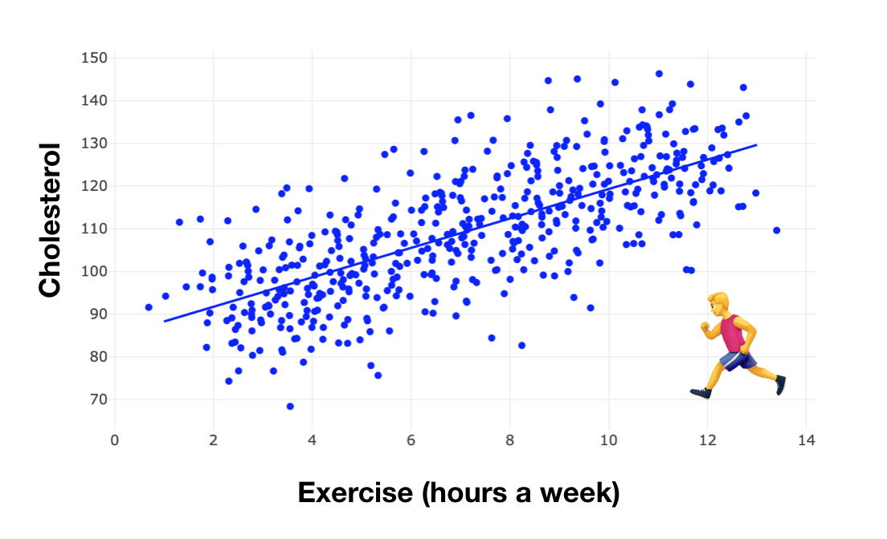
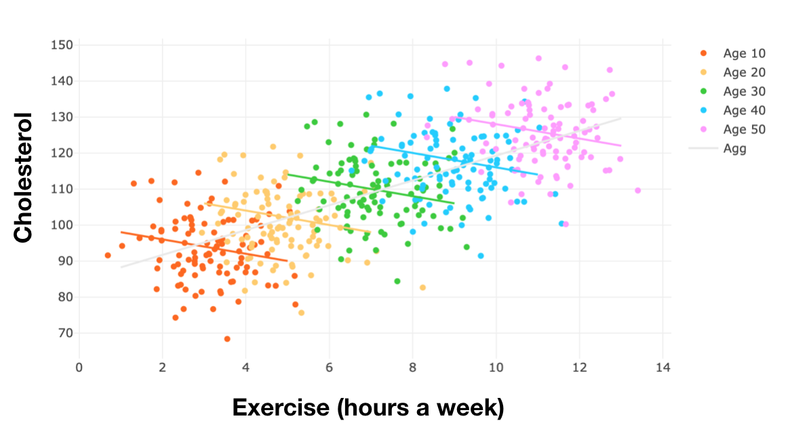
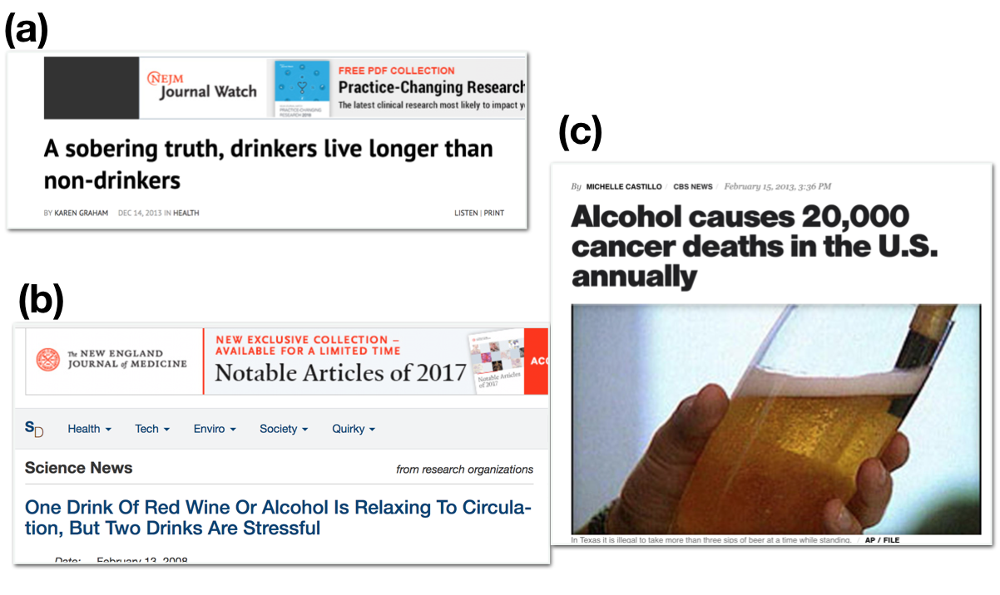

# 1. 들어가며: 상관관계 vs. 인과관계

다음과 같은 흥미로운 예시를 생각해 보겠습니다. 데이터 전문가 Yonghan 이 최근에 건강검진을 받았는데 콜레스테롤이 높게 나왔습니다. Yonghan 의 담당의사는 그에게 운동을 꾸준히 하여 콜레스테롤 수치를 줄여야 한다고 권고했습니다. 의심많은 과학적 회의주의자인 Yonghan은 운동-콜레스테롤의 관계가 어떻게 되는지 직접 판단하기 위해 수많은 사람들의 '매주 운동량 (hr)' - '콜레스테롤' 데이터를 모아서 plot 을 그리고, 선형회귀분석을 통해서 그 경향을 분석했습니다. 그리고 놀랍게도, 운동량 - 콜레스테롤은 양의 상관관계를 나타냈습니다! 이 결과를 바탕으로 데이터 전문가는 ‘운동을 많이 할수록 콜레스테롤이 증가한다’ 라고 결론을 내려야 할까요?

이 예시를 조금 더 진행해보겠습니다. 운동, 콜레스테롤에 더해 연령 (Age) 데이터 (10대, 20대, …, 50대) 를 추가로 수집했다고 가정하죠. 각 연령별로 운동-콜레스테롤의 관계를 분석하기 위해서 선형회귀분석을 수행했더니 다음과 같은 결과가 나왔습니다. 

놀랍게도, 모든 연령에서, Exercise-Cholesterol 은 음의 상관관계를 나타냈습니다. 그렇다면, 우리는 이를 어떻게 설명해야 할까요? 운동을 하면, 콜레스테롤은 증가할까요 (그림 1)? 아니면 감소할까요 (그림 2)? 이렇듯, 두 변수 사이의 인과관계를 조사할 때, 제 3의 변수로 인해서 그 해석이 완전히 정반대가 되는 현상을 Simpson's paradox 라고 합니다. 

이 이야기의 핵심은, 두 변수간의 인과관계 (운동 -> 콜레스테롤)을 파악하기 위해서는 상관관계만으로는 부족하다는 것입니다. 물론 통계101 에서 여러분들이 가장 많이 듣는 이야기가 바로 '상관관계는 인과관계가 아니다' 일 것입니다. 하지만 아주 많은 경우에, 상관관계가 인과관계가 아니라는 사실은 간과되곤 합니다. 많은 학술논문에서 상관관계 (경향성) 을 보여주고 나서는 마치 인과관계를 밝혀낸 것 처럼 호도하죠. 다음의 예시를 보시죠. 

모두 저명한 의학분야 논문에서 발최한 기사들입니다. 보시듯, 음주가 건강에 긍정적인 효과가 있는지 / 부정적인 효과가 있는지 같은 저널 안에서도 의견이 이렇게 나뉩니다. 위 논문들은 모두 경향성을 분석한 것임에도 불구하고, 저명한 의학 논문조차 상관관계와 인과관계를 호도하는 것을 볼 수 있습니다. 

