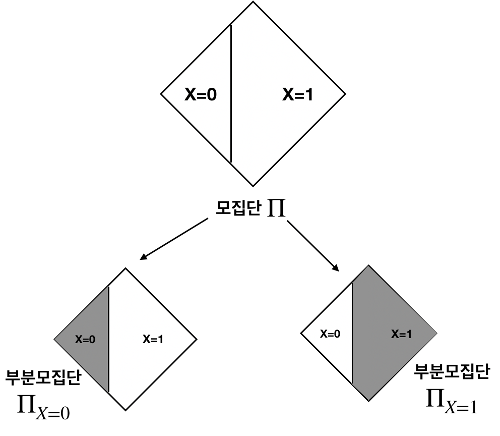
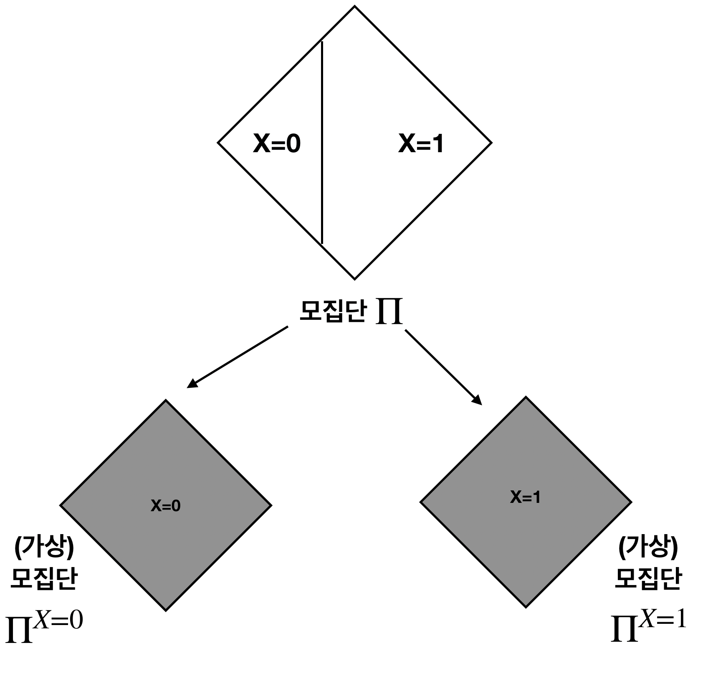

# 2. 인과관계 확률변수 $Y_x$ 

이번 글에서는, 인과관계 (Causation)의 개념을 수학적 기호 (notation) 을 적용하여 설명하고자 합니다. 

경제학/예방의학 등의 학문에서는 ***ceterius paribus*** ('다른 모든 조건이 동일할 때' 를 뜻하는 라틴어) 라는 널리 사용되는 가정이 있습니다. $X,Y$ 두 변수 사이의 관계를 설명할 때, 제 3의 변수 ($Z$) 가 개입하여 $(X,Y)$ 사이의 관계를 혼동시키는 것을 막기 위해서, 다른 모든 조건 (i.e., $Z$)이 동일할 때, $X$가 변하면 $Y$가 어떻게 변하는지 설명하기 위한 조건입니다.  [1. 상관관계와 인과관계](https://github.com/yonghanjung/causalblog-Kor/blob/master/Journey%20to%20SCM/1.%20%EC%83%81%EA%B4%80%EA%B4%80%EA%B3%84%EC%99%80%20%EC%9D%B8%EA%B3%BC%EA%B4%80%EA%B3%84.md) 에 소개된 예시에 이 조건을 적용하면 ‘연령’ 이라는 제 3의 변수가 (운동, 콜레스테롤) 의 관계를 혼동시키고 있는 것을 알 수 있습니다. 이를 막기 위해서 우리는 ‘다른 모든 조건이 동일할 때’ 운동과 콜레스테롤의 관계를 보아야 합니다. 

두 변수 ($X,Y$) 를  *Ceterius Paribus* 의 경구에 맞추어 생각해보면,  **다른 조건이 모두 동일할 때** $X$ 의 값이 변할 때 확률변수 $Y$ 라고 할 수 있습니다. 이 조건하에서, $Y$ 의 변화를 유발시키는 유일한 요소는 $X=x$ 이기 때문에, 이 확률변수는 직관적으로 인과관계를 함의한다고 생각할 수 있습니다.

이 직관을 수학적 개념으로 엄밀히 발전시킨 사람은 [Donald Rubin](https://en.wikipedia.org/wiki/Donald_Rubin) 입니다. $X,Y$ 가 각각 관심있는 원인, 결과에 해당하는 변수일 때, Rubin 은 다른 모든 상황이 동일할 때, X=x 일 때 확률변수  Y 를 표현하기 위해 $Y_{X=x}$ (간략하게, $Y_x$) 라는 변수를 도입했습니다. 이 변수를 깊이 이해하기 위해서  X=x 가 주어져있을 때 확률변수 Y  (즉, $Y\vert x$) 와 대조하여 보겠습니다. 논의를 실제 예시와 연관지어 진행하기 위해서, 이 글에서는  $X=1$ 은 운동을 함 / $X=0$ 은 운동을 안함이라고 정의하겠습니다. 또한, $Y$ 는 콜레스테롤 수치라고 가정하겠습니다. 우리가 수집한 환자집단을 $\Pi$ 라고 적겠습니다. 일반적으로 가장 관심이 많은 quantity 는 $\mathbb{E}\left[Y\right]$ 이기 때문에, 우리는 $\mathbb{E}\left[Y \vert X=x\right]$ 와 $\mathbb{E}\left[Y_x\right]$ 를 비교해 보겠습니다. 

우선 조건부 확률 $Y\vert X=0$, $Y \vert X=1$ 은 운동을 안 할 때 / 할 때 확률변수 $Y$ 입니다. 구체적으로, 확률변수 $Y$가 모집단 $\Pi$ 에서 정의된 확률변수라면, $Y \vert X=x$ 은 모집단에 속한 환자 중 $X=x$ 인 환자들만 모아 놓은 부분모집단 $\Pi_{X=x}$  에서 정의되는 확률변수 $Y$ 입니다. 한 마디로 조건부 확률변수는 축소된 sample space 에서 정의된 확률변수를 말합니다. [그림 1]은 이 논의를 시각화하여 표현합니다. 

|  |
| :----------------------------------------------: |
|       [그림 1] 확률변수 $Y\vert X=x$         |

위 그림에서, $Y\vert X=0$, $Y \vert X=1$ 은 각각 shaded area 에서 정의되는 확률변수 $Y$ 를 의미합니다. 

한편, 이 확률변수는 모든 조건이 동일할 때 X=x 일 때 Y  를 의미하지는 않습니다. 왜냐하면, $Y \vert X=0$ 과 $Y \vert X=1$ 이 정의된 부분모집합 (shaded area) 들이 '다른 모든 조건이 동일할 때  조건을 만족할리 없기 때문이죠 (즉, $\Pi_{X=0} \neq \Pi_{X=1}$). 따라서, $\mathbb{E}[Y \vert X=x]$ 는 $\mathbb{E}[Y_x]$ 와 같지 않은 값입니다. 

한편, $Y_{X=x}$ 는 '모든 모집단의 환자들이 X=x 라고 가정할 때'  확률변수 $Y$ 를 의미합니다. 구체적으로, 모집단 $\Pi$ 에 대해서 모든 모집단의 구성원들이 $X=x$ 라고 가정한 *가상모집단* $\Pi^{X=x}$ 의 확률변수 $Y$ 를 말하죠. [그림 2] 는 다음과 같은 설명을 시각화하여 표현합니다. 

|  |
| :----------------------------------------------: |
|       [그림 2] 확률변수 $Y_{x}$         |

이 정의는 모든 조건이 동일할 때 X=x 일 때 Y  를 만족합니다. 왜냐하면, $\Pi^{X=0}$ 와 $\Pi^{X=1}$ 은 다른 모든 조건이 동일하고 오직 $X=x$ 만 다르기 때문이죠. 

정리하면 다음과 같습니다. 

* $Y \vert X=x$ 는 모집단 $\Pi$ 중 $X=x$ 를 가지는 부분모집단 $\Pi_{X=x}$ 에서 정의되는 확률변수 $Y$; 
* $Y_{X=x}$ 는 모집단 $\Pi$ 의 모든 구성원이 $X=x$ 를 가진다고 *가정*할 때 (가상모집단 $\Pi^{X=x}$) 정의되는 확률변수 $Y$. 

