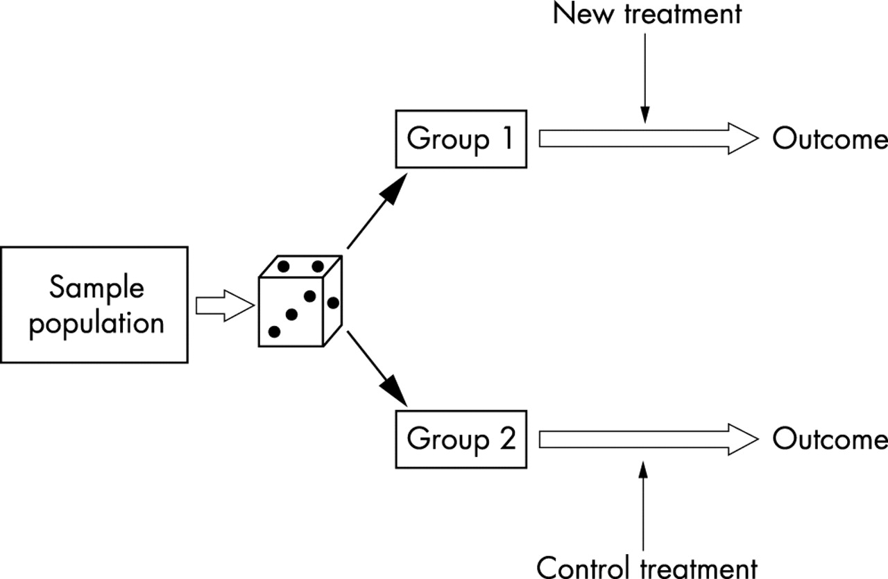

# 3. 무작위 실험 (Randomized controlled trial, RCT): 실생활에서 어떻게 $Y_x$ 를 도출할까?

## 지난 이야기 

[1화](https://github.com/yonghanjung/causalblog-Kor/blob/master/Journey%20to%20SCM/1.%20%EC%83%81%EA%B4%80%EA%B4%80%EA%B3%84%EC%99%80%20%EC%9D%B8%EA%B3%BC%EA%B4%80%EA%B3%84.md)에서는 상관관계와 인과관계가 다르다는 이야기를 했습니다. 

[2화](https://github.com/yonghanjung/causalblog-Kor/blob/master/Journey%20to%20SCM/2.%20%EC%9D%B8%EA%B3%BC%EA%B4%80%EA%B3%84.md)에서는 $X=x$ 의 움직임이 원인이 되어 변화하는 확률변수 $Y$ (즉, potential outcome $Y_x$) 를 정의했습니다. 특히,

* $Y_x$ 는 모집단의 모든 구성원이 $X=x$ 일 때 확률변수 $Y$ 이며; 
* $X=x$ 가 주어진 부분모집단 $\Pi_{X=x}$ 에서는 조건부 확률변수 $Y \vert X=x$ 와 $Y_x \vert X=x$ 는 같다,

는 것을 배웠습니다. 

## 무작위 실험 (Randomized controlled trial, RCT)

[2화](https://github.com/yonghanjung/causalblog-Kor/blob/master/Journey%20to%20SCM/2.%20%EC%9D%B8%EA%B3%BC%EA%B4%80%EA%B3%84.md)에서 배웠듯이 우리가 관측할 수 있는 potential outcome variable $Y_x$ 는 오직 $X=x$ 가 주어졌을 때 뿐입니다. 즉, 우리는 $(Y_x \vert X=x)$ 만 관측할 수 있죠. 그렇다면, 일반적으로 $Y_x$ 를 어떻게 관측할 수 있을까요? 일반적으로 우리가 관심있는 통계수치 (estimates) 는 $\mathbb{E}[Y_x]$ 이기 때문에, 이번 글부터는 개별적인 확률변수 $Y_x$ 대신 $\mathbb{E}[Y_x]$ 혹은 $P(y_x)$ 을 관심있는 수치로 하여 서술하겠습니다. 

[2화](https://github.com/yonghanjung/causalblog-Kor/blob/master/Journey%20to%20SCM/2.%20%EC%9D%B8%EA%B3%BC%EA%B4%80%EA%B3%84.md)의 처음 부분에서 우리는 $\mathbb{E}[Y_{X=1}] -\mathbb{E}[ Y_{X=0}]$ 은 **모든 조건이 같을 때** $X=1$ 과 $X=0$ 에 따른 확률변수 기대값 $Y$의 변화라고 하였습니다. 과연, 어떤 실험디자인이 '모든 조건은 같지만 $X$ 의 값만 다른' 조건을 만족할 수 있을까요? 

이에 대한 대답으로, 무작위로 $X=x$ 를 할당하는 실험디자인 (무작위 실험, 혹은 RCT) 를 생각해보겠습니다. RCT 는 모집단의 모든 구성원에 대해서 $X=0$ 혹은 $X=1$ 을 무작위로 할당하는 실험디자인입니다. 예를 들어서, 동전이 앞면 (H) 이면 $X=1$, 그리고 뒷면 (T) 이면 $X=0$ 으로 할당하는 방식이죠. 이러한 실험디자인은 [그림 1] 에 잘 설명되어 있습니다. 

|  |
| :--------------------------------------------: |
|           [그림 1] 무작위 실험 (RCT)           |

환자 개개인마다 동전을 던져서 Head 이면 Group 1, Tail 이면 Group 2 에 할당했다고 합시다. 그리고 Group 1 은 $X=1$ 을 주고, Group 0 이면 $X=0$ 을 주었다고 합시다. 요약하면 다음과 같습니다. 

| Head/Tail | Group assignment     |  $X$    |
| ---- | ---- | ---- |
|  Head    |  Group 1  |   $X=1$   |
| Tail | Group 2 | $X=0$ |

이 때, Group 1 과 Group 2 의 환자들은 다른 모든 조건 (평균 나이, 성비 등등) 은 같고 오직 $X=x$ 만 다르다고 할 수 있을까요? Sample 의 수가 많다면 Group1 과 Group2 의 유의미하게 다른 점은 오직 $X=x$ 일 뿐일 것입니다. Random 하게 환자그룹을 나누었다면, 두 그룹의 연령분포 등은 비슷하겠죠? 그것이 아니라면, 무작위하게 환자 그룹을 나누었다고 할 수 없을 겁니다. 따라서, Group 1 과 Group 2 의 $Y$ 의 차이는, **다른 모든 조건이 동일할 때** $Y_x$ 의 차이, $Y_{X=1} - Y_{X=0}$ 로 이해할 수 있습니다. 

정리하면, 무작위 (동전던지기 등)로 환자를 두 그룹으로 나누어 각각 $X=1$, $X=0$ 을 배정하며 각 그룹의 $Y$ 의 차이는  **다른 모든 조건이 동일할 때** $Y_x$ 의 차이, $Y_{X=1} - Y_{X=0}$ 로 *직관적으로* 이해할 수 있습니다. 

이러한 실험디자인을 무작위실험 (Randomized controlled trial, RCTs) 라고 하며, $X=x$ 에 따른 $Y$ 의 인과를 알기 위해서 가장 널리 통용되는 (Gold standard 라고 불리는!) 실험디자인입니다. 

## RCT 의 아이디어: Exchangeability (a.k.a. ignorability) 

위에 *직관적으로* 이해할 수 있다는 표현을 썼습니다. 