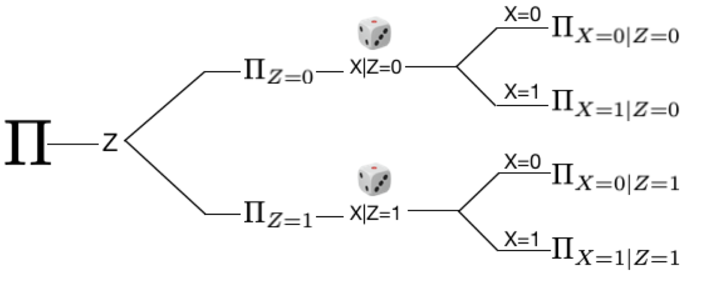

# 4. 조건부 무작위 실험: $Y_x$ 를 관측하는 또 다른 실험 디자인

## 지난 이야기 

[1화](https://github.com/yonghanjung/causalblog-Kor/blob/master/Journey%20to%20SCM/1.%20%EC%83%81%EA%B4%80%EA%B4%80%EA%B3%84%EC%99%80%20%EC%9D%B8%EA%B3%BC%EA%B4%80%EA%B3%84.md)에서는 상관관계와 인과관계가 다르다는 이야기를 했습니다. 

[2화](https://github.com/yonghanjung/causalblog-Kor/blob/master/Journey%20to%20SCM/2.%20%EC%9D%B8%EA%B3%BC%EA%B4%80%EA%B3%84.md)에서는 $X=x$ 의 움직임이 원인이 되어 변화하는 확률변수 $Y$ (즉, potential outcome $Y_x$) 를 정의했습니다. 특히,
* $Y_x$ 는 모집단의 모든 구성원이 $X=x$ 일 때 확률변수 $Y$ 이며; 
* **Consistency assumption**: $X=x$ 가 주어진 부분모집단 $\Pi_{X=x}$ 에서는 조건부 확률변수 $Y \vert X=x$ 와 $Y_x \vert X=x$ 는 같다는 것을 배웠습니다. 즉, $\mathbb{E}[Y_x \vert X=x] = \mathbb{E}[Y \vert X=x]$ 가 성립합니다. 

[3화](https://github.com/yonghanjung/causalblog-Kor/blob/master/Journey%20to%20SCM/3.%20%EB%AC%B4%EC%9E%91%EC%9C%84%EC%8B%A4%ED%97%98%20(RCT).md)에서는 $X=x$ 가 무작위로 할당된다면, 인과적 확률변수 $Y_x$ 는 $\mathbb{E}[Y_x] = \mathbb{E}[Y \vert X=x]$ 를 통해 관측될 수 있다는 것을 배웠습니다. 특히 

* **Exchangeability**: $X$ 를 무작위로 할당하면 (e.g., 동전던지기),  $Y_x \perp\mspace{-10mu}\perp X$ 가 만족한다. 
* 무작위 실험 하에서는 (= Exchangeability 가 성립하면),  $\mathbb{E}[Y_x] = \mathbb{E}[Y_x \vert X=x] = \mathbb{E}[Y \vert X=x]$ 가 성립한다는 것을 배웠습니다. 

## 조건부 무작위 실험 (Conditional RCT)

[3화](https://github.com/yonghanjung/causalblog-Kor/blob/master/Journey%20to%20SCM/3.%20%EB%AC%B4%EC%9E%91%EC%9C%84%EC%8B%A4%ED%97%98%20(RCT).md)에서, 우리는 $X=x$ 가 동전던지기 등을 통해서 무작위로 할당된다면, $\mathbb{E}[Y_x] = \mathbb{E}[Y \vert X=x]$ 가 성립하므로, 인과적 확률변수 $Y_x$ 는 단순히 조건부 확률변수 $Y \vert X=x $ 를 통해서 관측될 수 있다는 것을 배웠습니다. 

이번 글에선, 무작위 실험의 변형인 조건부 무작위 실험 디자인 (Conditional RCT) 을 소개하고자 합니다. 공식 명칭은 Alternative design of RCT 이지만, 더욱 명징하게 개념을 설명하기 위해서 조건부 무작위 실험이라는 이름을 붙였습니다. 조건부 무작위 실험이란 주어진 조건하에서 (= 부분모집단 하에서) 무작위로 $X=x$ 를 할당하는 실험 디자인을 이야기합니다. [그림 1] 에 잘 시각화되어 있습니다. 

|  |
| :------------------------------------------------: |
|   [그림 1] 조건부 무작위 실험 (Conditional RCT)    |

예를 들어, $Z=1$ 를 여성, $Z=0$  를 남성이라고 하겠습니다. 그렇다면, [그림 1]의 실험 프로토콜은 환자가 남성일 때, 무작위샘플링 방식으로 $X$ 를 할당하고; 환자가 여성일 때, 또 다른 무작위 샘플링 방식으로 $X$ 를 할당합니다. 다시 말해서, $X$ 를 $P(X=x \vert Z=z)$ (짧게, $P(x \vert z)$) 에 따라서 할당하는 방식이죠. 기존의 RCT 와 비교하면 다음과 같습니다. 

| 실험디자인                           | $X$ 할당방식                                    |
| ------------------------------------ | ----------------------------------------------- |
| RCT (무작위 실험)                    | $X \sim P(x)$                                   |
| Conditional RCT (조건부 무작위 실험) | $X \sim P(x \vert z)$; (주어진 $Z=z$ 에 대해서) |

3화에서 $X$ 가 무작위로 할당되어 있다면, $Y_x \perp \mspace{-10mu}\perp X$ 가 성립한다고 했습니다. 조건부 무작위 실험에서는, $Z=z$ 가 조건으로 주어져 있을 때 $X$ 를 무작위로 할당하기 때문에, 3화와 같은 논리로 인해서 $(Y_x \perp \mspace{-10mu} \perp X \vert Z=z)$ 가 성립합니다. 즉, $Z=z$ 가 주어져 있다면, $X$ 가 무엇이든간에 $Y_x$ 에는 영향을 미치지 않는 것이죠. 이를 ***Conditional exchangeability***  이라고 부릅니다. 

위의 실험디자인도 무작위 실험의 한 종류인 만큼, $\mathbb{E}[Y_x]$ 를 관측 가능합니다. 다음의 수식을 보시죠. 
$$
\begin{align}
	\mathbb{E}[Y_x] &= \sum_{z}\mathbb{E}[Y_x \vert z]P(z) \\ 
									&= \sum_{z}\mathbb{E}[Y_x \vert x,z]P(z) \\ 
                  &= \sum_{z} \mathbb{E}[Y \vert x,z]P(z).
\end{align}
$$
첫 번째 라인은 $Z=z$ 에 대한 marginalization; 두 번째 라인은 Conditional exchangeability, 세 번째 라인은 consistency assumption 에 의해서 성립됩니다. 즉, $\mathbb{E}[Y_x]$ 는 주어진 데이터를 이용하여 $\mathbb{E}[Y \vert x,z]$ 와 $P(z)$ 를 계산하여 구할 수 있습니다. 

## 관측데이터를 이용하여 $\mathbb{E}[Y_x] $ 를 추론하기 

